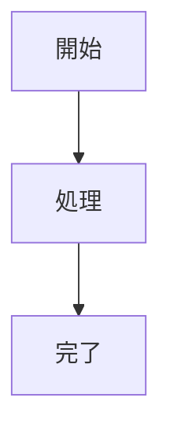

# pandoc-md-to-pdf-sample

Pandoc を使って Markdown を PDF に変換するサンプルリポジトリです。
[pandoc-ext/diagram](https://github.com/pandoc-ext/diagram) の Lua フィルタを利用し、Mermaid 図のレンダリングに対応しています。

## 必要なツール

devcontainer を使うと以下が自動的にセットアップされます。

- [Pandoc](https://pandoc.org/)
- XeLaTeX（texlive-xetex）
- 日本語フォント（Noto CJK）
- [Mermaid CLI（mmdc）](https://github.com/mermaid-js/mermaid-cli)

## 使い方

### 単一ファイルの変換

```bash
bash scripts/convert.sh
```

`docs/basic-design.md` を変換して `output/basic-design.pdf` を生成します。

### 全ファイルの一括変換

```bash
bash scripts/convert-all.sh
```

`docs/` 以下のすべての `.md` ファイルを変換して `output/` に PDF を生成します。

## サンプルドキュメント

| ファイル | 内容 |
|----------|------|
| `docs/basic-design.md` | Webアプリケーション基本設計書（システム構成・機能設計・API設計） |
| `docs/er-design.md` | データベース設計書（ER図・テーブル定義・DDL・インデックス設計） |
| `docs/api-spec.md` | API仕様書（エンドポイント一覧・リクエスト/レスポンス例・エラーコード） |

## ファイル構成

```
├── docs/
│   ├── basic-design.md      # Webアプリケーション基本設計書
│   ├── er-design.md         # データベース設計書
│   └── api-spec.md          # API仕様書
├── filters/
│   └── diagram.lua          # pandoc-ext/diagram フィルタ
├── pandoc/
│   ├── defaults.yaml        # Pandoc 設定
│   ├── mermaid-config.json  # Mermaid フォント設定
│   └── puppeteer-config.json # Puppeteer Chrome 起動オプション
├── scripts/
│   ├── convert.sh           # 単一ファイル変換スクリプト
│   ├── convert-all.sh       # 全ファイル一括変換スクリプト
│   └── mmdc-wrapper.sh      # mmdc ラッパー（puppeteer 設定を付与）
└── output/                  # PDF 出力先（.gitignore 対象）
```

## Mermaid 図の書き方

Markdown 内で ` ```mermaid ` または ` ```{.mermaid} ` のコードブロックとして記述すると図として変換されます。

````markdown

````

## Chromeサンドボックスに関する注意事項

Ubuntu 23.10 以降では AppArmor により unprivileged user namespaces がデフォルト無効になっており、
Chrome のサンドボックス機能が使えないため `--no-sandbox` フラグが必要です。
`pandoc/puppeteer-config.json` でこのフラグを設定し、`scripts/mmdc-wrapper.sh` 経由で mmdc に渡しています。

- 参考 issue: https://github.com/mermaid-js/mermaid-cli/issues/730
